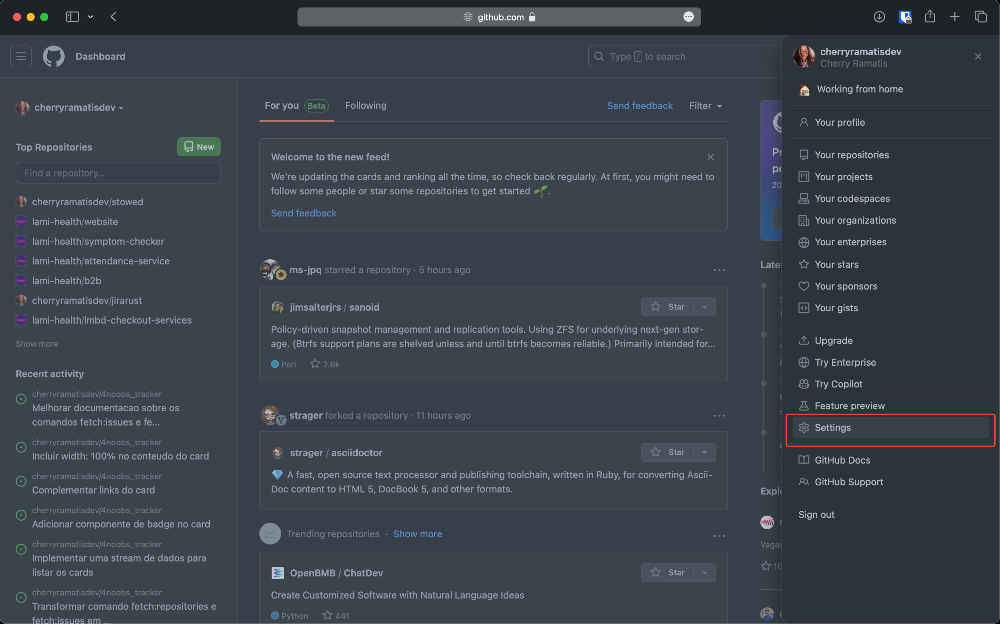
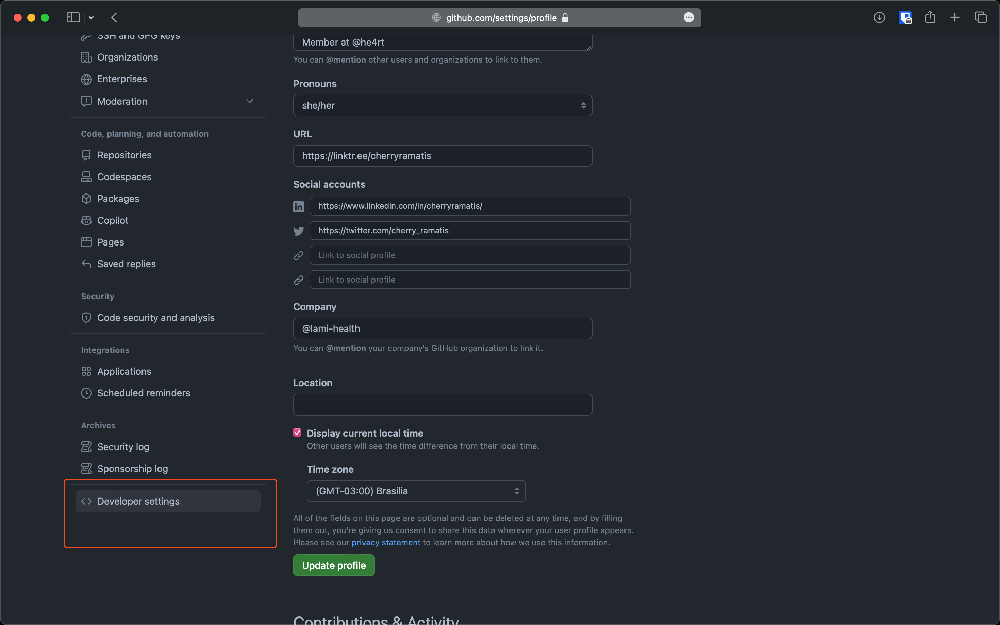
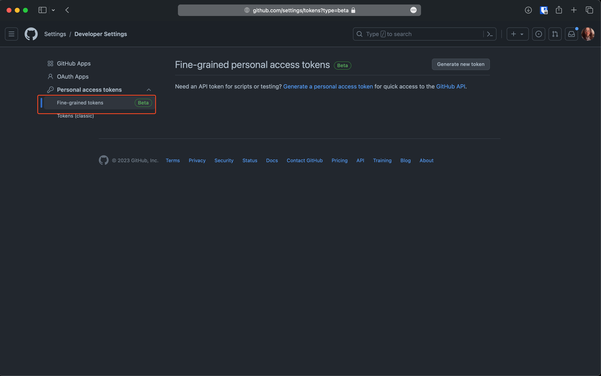

# Como criar um token GitHub

Para que possamos executar o comando `fetch:issues` que pega todas as issues do github, precisamos ter uma chave de acesso na API deles. Essa chave pode ser configurada de maneira muito simples seguindo o passo a passo abaixo:

1. Primeiro entre nas configurações da sua conta:



2. Depois entre nas sessão de desenvolvedor (scrollando ate o final da pagina):



3. Selecione a aba de "Personal access token" e então "Fine-grained tokens" para poder visualizar seus tokens



4. Clique no botão "Generate New Token", digite um nome para seu token e faça scroll diretamente para o final da pagina

[How to create a new token](github-token.mov)

5. Agora que você conseguiu copiar o token, crie um arquivo `.env` na pasta do projeto com o seguinte conteudo:

```
GH_API_TOKEN=seutokenaqui
```

Parabéns! Agora você deve conseguir executar o comandos descritos no [README](/README.md) facilmente.

Caso reste alguma duvida, por favor me chame!